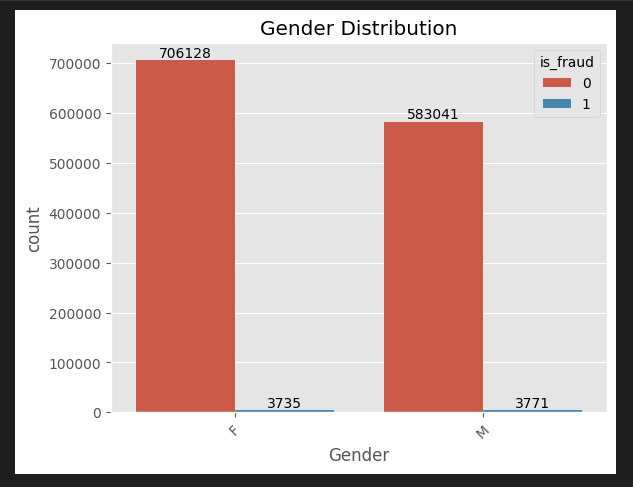

**Credit Card Transaction Fraud Detection**

**0.1 Problem Statement**

Fraud detection is a set of activities undertaken to prevent money or property from being obtained through false pretenses. Fraud detection is applied to many industries such as banking or insurance. In banking, fraud may include forging checks or using stolen credit cards. Other forms of fraud may involve exaggerating losses or causing an accident with the sole intent for the pay-out. With an unlimited and rising number of ways someone can commit fraud, detection can be difficult to accomplish. Fraud detection is a critical issue for retailers determined to prevent losses and preserve customer trust. Design and code a solution using python and machine learning techniques to classify fraudless and fraud credit card transactions.

**Solution**

Our process will start with Exploratory Data Analysis (EDA) with a goal to gain better insight about our data set and eventually develop a model using machine learning methodology.

1. **Exploratory Data Analysis**

I have obtained the data set and now it is time to perform an Exploratory data Analysis (EDA) to gain insight about the dataset and prepare the data for modeling purposes.

**1.1 Dataset**

**fraudTrain.csv** is a simulated credit card transaction dataset containing legitimate and fraud transactions from the duration 1st Jan 2019 - 31st Dec 2020. It covers credit cards of 1000 customers doing transactions with a pool of 800 merchants.

**1.2 Initial Observation**

- The dataset contains 1296675 observation
- The Data set contains no null values neither duplicate values
- The dataset contains a total of 23 columns out of which we have a single dependent variable labeled is_fraud
- The is_fraud feature contains two categories 0 and 1, which represent honest and fraud transactions respectively

**1.3 Distribution**

**1.3.1 Distribution of Gender**

The following diagram shows the distribution of gender based on wheather the transaction was fradulent or not where F represents female while M represents male

**Figure 1.** Distribution of Gender in the Dataset

**1.3.2 Distribution of Gender**

The following diagram shows the distribution of the merchant category in which the credit card transactions in the dataset occurred.

**Figure 2.** Distribution of Merchant Category in the Dataset

**1.3.3 Distribution of Fraudulent Transaction**

The following diagram shows the percentage distribution of fraudulent transaction in the dataset and we can absorb that the data is lopsided with only 0.6%pf the dataset representing fraud transactions and we must make sure t

**Figure 3.** Percentage Distribution of Fraud Transaction in the Dataset

1. **Data Cleaning**

The subsequent action are taken in the following steps:

- Checking dataset for null and duplicate values
- Renaming the columns of the dataset
- Dropping irrelevant columns after which only 11 columns remain which are 'cc_num', 'Amount', 'Gender','zip', 'lat', 'long', 'city_pop', 'unix_time', 'merch_lat', 'merch_long', 'is_fraud'
- Applying one hot encoding for ‘Gender’

1. **Approach**

I prepare the data from the EDA for machine learning model development by creating a train and test split by 70% and 30% respectively.

**3.1 Machine Learning Approach**

In this approach, we use three machine learning algorithms:

- Decision Tree Model
- Random Forest Model
- Xgboost Model

**3.1.1 Decision Tree Model**

**Results & Metrics :** The following diagram shows the confusion matrix and classification report with precision, recall, and F1-score.

**Figure 4.** Classification Report for Decision Tree

**Metrics Explained**

Term Explanation

- **Precision**: The proportion of correctly identified instances among those labeled as positive. It measures how often the model is correct when it predicts a positive result.
- **Recall**: The proportion of actual positive instances that were correctly identified. It measures how often the model correctly identifies all positive cases.
- **F1-score**: The harmonic mean of precision and recall, providing a balanced measure of accuracy that considers both. Higher F1-scores indicate better overall performance.
- **Support**: The number of instances for each class in the dataset. It shows how much data was available for training and evaluation.

**Overall Performance:**

- **Accuracy**: 0.99(how often the model makes correct predictions)
- **Precision**: How many of the model’s transaction predictions were actually correct.
  - Precision for fraudless transaction prediction: 1 (out of 386505 fraudless transactions predictions, 99.67% were correctly classified as fraudless transaction)
  - Precision for Fraud transaction prediction: 0.40 (out of 2498 fraud transactions predictions, 40% were correctly classified as fraud transaction)
- **Recall**: How many of the actual transactions did the model classify correctly.
  - Recall for fraudless transaction: 1 (out of 386764 actual fraudless transaction cases, the model predicted 99.61% correctly)
  - Recall for fraud transaction : 0.45 (out of 2239 actual fraud transaction cases, the model predicted 45% correctly)
- **F1-Score:** Harmonic mean between precision and recall
  - F1-score for fraudless transaction: 0.9963
  - F1-score for fraud transaction: 0.42

**3.1.2 Random Forest Model**

**Figure 5.** Classification Report for Random Forest Model

Class Specific Metrics:

- **Accuracy**: 0.99629(how often the model makes correct predictions)
- **Precision**: How many of the model’s transaction predictions were actually correct.
  - Precision for fraudless transaction prediction: 1 (out of 387726 fraudless transactions predictions, 99.69% were correctly classified as fraudless transaction)
  - Precision for Fraud transaction prediction: 0.81 (out of 1277 fraud transactions predictions, 81% were correctly classified as fraud transaction)
- **Recall**: How many of the actual transactions did the model classify correctly.
  - Recall for fraudless transaction: 1 (out of 386764 actual fraudless transaction cases, the model predicted 99.69% correctly)
  - Recall for fraud transaction : 0.46 (out of 2239 actual fraud transaction cases, the model predicted 46% correctly)
- **F1-Score:** Harmonic mean between precision and recall
  - F1-score for fraudless transaction: 0.9963
  - F1-score for fraud transaction: 0.59

**3.1.3 xgboost Model**

**Figure 6.** Classification Report for xgboost Model

Class Specific Metrics:

- **Accuracy**: 0.99(how often the model makes correct predictions)
- **Precision**: How many of the model’s transaction predictions were actually correct.
  - Precision for fraudless transaction prediction: 1 (out of 387726 fraudless transactions predictions, 99.69% were correctly classified as fraudless transaction)
  - Precision for Fraud transaction prediction: 0.65 (out of 1277 fraud transactions predictions, 65% were correctly classified as fraud transaction)
- **Recall**: How many of the actual transactions did the model classify correctly.
  - Recall for fraudless transaction: 1 (out of 386764 actual fraudless transaction cases, the model predicted 99.93% correctly)
  - Recall for fraud transaction : 0.45 (out of 2239 actual fraud transaction cases, the model predicted 26% correctly)
- **F1-Score:** Harmonic mean between precision and recall
  - F1-score for fraudless transaction: 0.9963
  - F1-score for fraud transaction: 0.37
