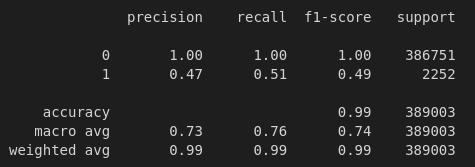
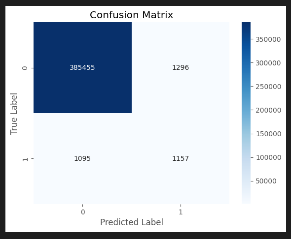
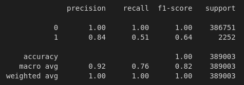
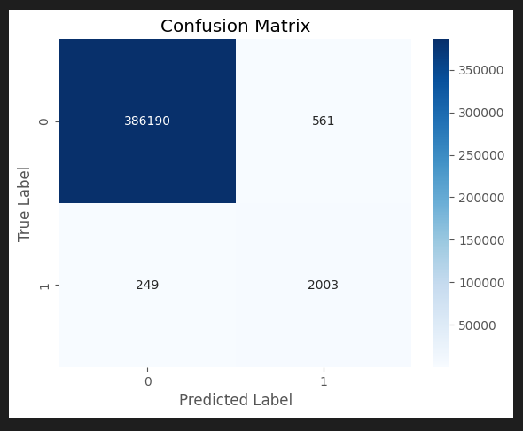

<h1 align="center">Credit Card Transaction Fraud Detection</h1>

## 0.1 Problem Statement ❓

Fraud detection is a set of activities undertaken to prevent money or property from being obtained through false pretenses. Fraud detection is applied to many industries such as banking or insurance. In banking, fraud may include forging checks or using stolen credit cards. Other forms of fraud may involve exaggerating losses or causing an accident with the sole intent for the pay-out. With an unlimited and rising number of ways someone can commit fraud, detection can be difficult to accomplish. Fraud detection is a critical issue for retailers determined to prevent losses and preserve customer trust. Design and code a solution using python and machine learning techniques to classify fraudless and fraud credit card transactions.

## Solution 🎯

Our process will start with Exploratory Data Analysis (EDA) with a goal to gain better insight about our data set and eventually develop a model using machine learning methodology.

## 1. Exploratory Data Analysis 🕵🏻

I have obtained the data set and now it is time to perform an Exploratory data Analysis (EDA) to gain insight about the dataset and prepare the data for modeling purposes.

**1.1 Dataset**

**fraudTrain.csv** is a simulated credit card transaction dataset containing legitimate and fraud transactions from the duration 1st Jan 2019 - 31st Dec 2020. It covers credit cards of 1000 customers doing transactions with a pool of 800 merchants.

**1.2 Initial Observation**

- The dataset contains 1296675 observation
- The Data set contains no null values neither duplicate values
- The dataset contains a total of 23 columns out of which we have a single dependent variable labeled is_fraud
- The is_fraud feature contains two categories 0 and 1, which represent honest and fraud transactions respectively

**1.3 Distribution**

**1.3.1 Distribution of Fraudulent Transaction**

The following diagram shows the percentage distribution of fraudulent transactions in the dataset and we can observe that the data is imbalanced with only 0.6% of the dataset representing fraud transactions.

**Figure 1.** Percentage Distribution of Fraud Transaction in the Dataset

**1.3.2 Distribution of Gender**

The following diagram shows the distribution of gender based on whether the transaction was fraudulent or not where F represents female while M represents male.

**Figure 2.** Distribution of Gender in the Dataset

## 2. Data Preprocessing and Data Cleaning ⏳

**2.1. Data Preprocessing**

In this phase of the process I accomplish 3 major things listed below: 
- One hot encoding the "Gender" feature
- Scaling the "Amount feature using the min-max scaling
- Dimension reduction by selecting only features with integer or float data type for model development
- Reducing multicollinearity by removing independent features with high correlation with other independent features
  
**2.1.1. Reducing Multicollinearity**

The following diagram is a heatmap that shows correlation between all our numerical features: 

**Figure 3.** Correlation Heatmap

Following the insight from this heatmap "zip", "merch_lat" and "merch_long" where dropped as features and only 8 features remain i.e "cc_number", "Amount_Scaled","Gender","lat","long","city_pop","unix_time","is_fraud".

**2.2. Data Cleaning**

The subsequent action are taken in the following steps:

- Checking dataset for null and duplicate values
- Renaming the columns of the dataset

**2.3. Observations from EDA**

To make insightful observation I split the dataset into legit and fraud transaction to check for statistical anomalies and discovered that distribution of "Amount" feature in legit and fraud transaction was noticeably different as shown in the diagram below:

**Figure 4.** Distribution of Amount in Legit and Fraud Transaction 

- The major thing to notice is that our dataset has a major imbalance in the target feature with only 0.6% data representing fraud transactions while 99.4% represent fraudless transactions.
- Multicollinearity was present in high levels with features such as 'zip','merch_long','merch_lat'
- Very little correlation was observed between our dependent feature and independent feature
- 'Amount' feature had the highest correlation of 0.22 to the target feature 
- We can notice the distribution of amount between legitimate fraud transaction are quite different
- The statistical measures between legit and fraud transaction vary significantly
- The mean value of amount is significantly smaller for legit transaction compared with fraud transaction 
- The distribution shows that most legit transaction occurs in smaller amounts with the statistical data confirming that around 75% percentile data falls below $82.54

## 3. Approach 🤖

I prepare the data from the EDA for machine learning model development by creating a train and test split by 70% and 30% respectively. In this phase we stratify the data so that the train and the test split have equal proportions of both the class of our dependent variable. We do this to improve the models performance as the data is heavily imbalanced. We cannot use techniques for balancing the dataset such as under or over sampling as this is financial data where the nature of the dataset will change significantly with sampling and there will be a large loss of data to balance the dataset with this method. 

**3.1. Machine Learning Approach**

In this approach, we use six machine learning algorithms:

- Decision Tree Model
- Random Forest Model
- Xgboost Model
- CatBoosting Model
- Pycaret
- K-Neighbors Classifier

**3.1.1. Decision Tree Model**

**Results & Metrics :** The following diagram shows the confusion matrix and classification report with precision, recall, and F1-score.

**Figure 5.** Classification Report for Decision Tree

**Metrics Explained**

Term Explanation

- **Precision**: The proportion of correctly identified instances among those labeled as positive. It measures how often the model is correct when it predicts a positive result.
- **Recall**: The proportion of actual positive instances that were correctly identified. It measures how often the model correctly identifies all positive cases.
- **F1-score**: The harmonic mean of precision and recall, providing a balanced measure of accuracy that considers both. Higher F1-scores indicate better overall performance.
- **Support**: The number of instances for each class in the dataset. It shows how much data was available for training and evaluation.

**Overall Performance:**

- **Precision**: How many of the model’s transaction predictions were actually correct.
  - Precision for fraudless transaction prediction: 1 (out of 386550 fraudless transactions predictions, 99.71% were correctly classified as fraudless transaction)
  - Precision for Fraud transaction prediction: 0.47 (out of 2453 fraud transactions predictions, 47% were correctly classified as fraud transaction)
- **Recall**: How many of the actual transactions did the model classify correctly.
  - Recall for fraudless transaction: 1 (out of 386764 actual fraudless transaction cases, the model predicted 99.66% correctly)
  - Recall for fraud transaction : 0.51 (out of 2252 actual fraud transaction cases, the model predicted 51% correctly)
- **F1-Score:** Harmonic mean between precision and recall
  - F1-score for fraudless transaction: 1.00
  - F1-score for fraud transaction: 0.49

**3.1.2. Random Forest Model**

**Figure 6.** Classification Report for Random Forest Model

Class Specific Metrics:

- **Precision**: How many of the model’s transaction predictions were actually correct.
  - Precision for fraudless transaction prediction: 1 (out of 387628 fraudless transactions predictions, close to 100% were correctly classified as fraudless transaction)
  - Precision for Fraud transaction prediction: 0.84 (out of 1375 fraud transactions predictions, 81% were correctly classified as fraud transaction)
- **Recall**: How many of the actual transactions did the model classify correctly.
  - Recall for fraudless transaction: 1 (out of 386751 actual fraudless transaction cases, the model predicted close to 100% correctly)
  - Recall for fraud transaction : 0.51 (out of 2252 actual fraud transaction cases, the model predicted 51% correctly)
- **F1-Score:** Harmonic mean between precision and recall
  - F1-score for fraudless transaction: 1.00
  - F1-score for fraud transaction: 0.64

**3.1.3. XgBoost Model**

**Figure 7.** Classification Report for xgboost Model

Class Specific Metrics:

- **Precision**: How many of the model’s transaction predictions were actually correct.
  - Precision for fraudless transaction prediction: 1 (out of 388089 fraudless transactions predictions, close to 100% were correctly classified as fraudless transaction)
  - Precision for Fraud transaction prediction: 0.65 (out of 914 fraud transactions predictions, 65% were correctly classified as fraud transaction)
- **Recall**: How many of the actual transactions did the model classify correctly.
  - Recall for fraudless transaction: 1 (out of 386764 actual fraudless transaction cases, the model predicted close to 100% correctly)
  - Recall for fraud transaction : 0.26 (out of 2239 actual fraud transaction cases, the model predicted 26% correctly)
- **F1-Score:** Harmonic mean between precision and recall
  - F1-score for fraudless transaction: 1.0
  - F1-score for fraud transaction: 0.38
  
**3.1.4. CatBoost Model**

**Figure 8.** Classification Report for CatBoost Model

Class Specific Metrics:

- **Precision**: How many of the model’s transaction predictions were actually correct.
  - Precision for fraudless transaction prediction: 1 (out of 387618 fraudless transactions predictions, close to 100% were correctly classified as fraudless transaction)
  - Precision for Fraud transaction prediction: 0.90 (out of 1385 fraud transactions predictions, 90% were correctly classified as fraud transaction)
- **Recall**: How many of the actual transactions did the model classify correctly.
  - Recall for fraudless transaction: 1 (out of 386764 actual fraudless transaction cases, the model predicted close to 100% correctly)
  - Recall for fraud transaction : 0.56 (out of 2239 actual fraud transaction cases, the model predicted 56% correctly)
- **F1-Score:** Harmonic mean between precision and recall
  - F1-score for fraudless transaction: 1.0
  - F1-score for fraud transaction: 0.69
  
**3.1.5. PyCaret for best fit Model**

PyCaret was supposed to help me identify the best fit model by training multiple model and identifying the model that generated the best result but the result was not as intented as the code kept crashing my laptop. However I was able to generate a partial report from which i was able to identify that the K-Neighbors Classification might work best after which i seperately train this model. 

**Figure 9.** PyCaret Best Fit Model Crash

  
**3.1.5. K-Neighbors Classification Model (Best Fit Model)**

**Figure 10.** Classification Report for K-Neighbors Classification Model

Class Specific Metrics:

- **Precision**: How many of the model’s transaction predictions were actually correct.
  - Precision for fraudless transaction prediction: 1 (out of 386439 fraudless transactions predictions, close to 100% were correctly classified as fraudless transaction)
  - Precision for Fraud transaction prediction: 0.78 (out of 2564 fraud transactions predictions, 78% were correctly classified as fraud transaction)
- **Recall**: How many of the actual transactions did the model classify correctly.
  - Recall for fraudless transaction: 1 (out of 386751 actual fraudless transaction cases, the model predicted close to 100% correctly)
  - Recall for fraud transaction : 0.89 (out of 2252 actual fraud transaction cases, the model predicted 89% correctly)
- **F1-Score:** Harmonic mean between precision and recall
  - F1-score for fraudless transaction: 1.0
  - F1-score for fraud transaction: 0.83
